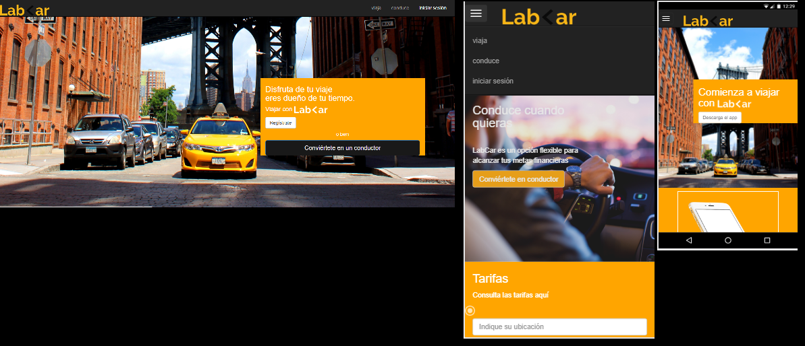

En el siguiente proyecto se mostrará el aplicativo LabCar en versión desktop y movil.

### Herramientas  
Se hizo uso del framework Bootstrap.
- jquery
- JavaScript
- CSS
- HTML

### Producto Final
 Vista de las diferentes pantallas

Ventanas Emergentes (modales)

